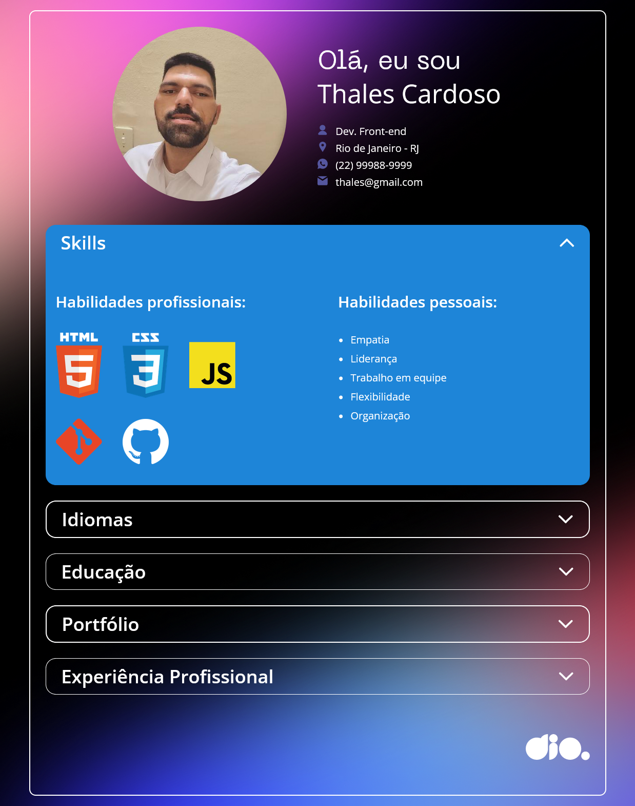

<h1 align="center">🏆 Desafio de projeto - Portfolio Pessoal</h1>

  Foi sugerido como desafio a criação de uma aplicação que fosse capaz de receber dados de uma API externa e o desenvolvimento do layout para essa API. 

  OBS: Por questão de segurança eu não coloquei meus dados pessoais corretamente, como telefone e email.

<h2>Conheça o projeto clicando na imagem abaixo:</h2>

<h2 id="features">✨ Features</h2>

- UI Responsiva
- Projeto com HTML , CSS e JS puro
- Consumo de API Rest

<h2 id="topics">📦 Temas abordados</h2>

O projeto possui como intuito aplicar os conceitos abordados na Trilha de Javascript da <a href="https://dio.me">DIO</a>, foi sugerido o uso do template visual já pronto, porém eu escolhi desenvolver o projeto todo do zero e fazer do meu jeito com base no layout do figma para aperfeiçoar meus conhecimentos de HTML e CSS.

Recursos presentes no projeto:
- HTML 5
- CSS 3
- Flexbox
- Responsividade
- Transições
- API REST
- jSON